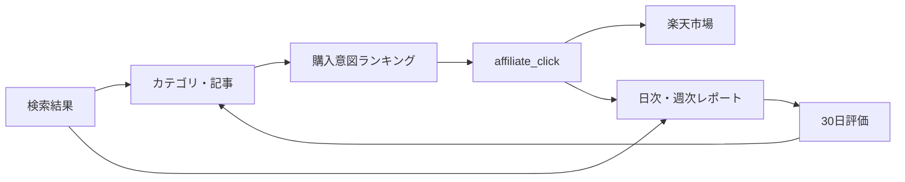

# ゼロ予算収益化改善 設計仕様

**作成日:** 2026-08-23  
**対象:** 楽天タイムセール速報  
**方針:** 初期投資ゼロ、SNS運用なし。初売上後のみ、確定収益の範囲内で再投資する。

## 1. 背景と現状

2026-08-13〜2026-08-19の確定データは次のとおり。

| 指標 | 実績 |
|---|---:|
| GSC表示回数 | 11 |
| GSCクリック | 0 |
| GA4セッション | 1 |
| GA4ページビュー | 1 |
| 計測可能な楽天クリック | 未実装 |
| 売上 | 0円 |

一般的なアフィリエイトリンクCTRを2〜5%と仮定すると、1セッションから期待できる楽天クリックは0.02〜0.05件であり、売上0円は異常ではない。現状の最大ボトルネックはコンバージョン率ではなく、購入意図のある検索流入の不足である。

一方、現行サイトには以下の二次的な問題がある。

- 商品クリックを日次・週次レポートで計測できず、流入後の離脱位置を判定できない。
- カテゴリページは「セール」を訴求しているが、API取得はジャンル指定のみで、購入理由の弱い商品も混ざる。
- APIレスポンスに含まれるポイント倍率、送料無料、アフィリエイト料率を商品選定や表示へ利用していない。
- 商品カード全体がリンクだが、クリック後の行動を明示するCTAがない。
- アフィリエイト表記がフッターにしかなく、最初の商品リンクより後に表示される。
- 既存8記事は情報量がある一方、比較結果から商品を選ぶための結論とCTAが弱い。

## 2. 目的

### 2.1 最終目的

広告費を使わず、検索流入から楽天市場への有効クリックを増やし、初回成果報酬を発生させる。

### 2.2 先行指標

売上だけでは母数不足時に改善判断ができないため、次の順序でファネルを計測する。

```text
GSC表示 → GSCクリック → GA4セッション → 楽天クリック → 成果報酬
```

最初の主要目標は累計楽天クリック50件とする。楽天側の購入率を1〜3%と仮定した場合、50クリックまでに1件以上購入される確率は約39〜78%である。

### 2.3 30日評価指標

リリース後30日間は、前30日比で次を評価する。

| 指標 | 最低成功条件 | 継続強化条件 |
|---|---:|---:|
| GSC表示回数 | 25%以上増加 | 100%以上増加 |
| GSCクリック | 1件以上 | 5件以上 |
| GA4オーガニックセッション | 5件以上 | 20件以上 |
| 楽天クリック | 3件以上 | 10件以上 |
| 楽天クリック率 | 2%以上 | 5%以上 |
| 成果報酬 | 参考値 | 1件以上で初売上達成 |

検索母数が小さいため、30日で楽天クリック50件を必達とはしない。50件は初売上の確率を評価できる累積目標として追跡する。

## 3. 非目的

- 広告出稿、有料SEOツール、有料生成AI APIは導入しない。
- SNSアカウントの作成、投稿、投稿自動化は行わない。
- 内容の薄いキーワードページを大量生成しない。
- アフィリエイト料率だけで商品順位を決めない。
- 実際に確認していない商品の使用感や効果を断定しない。
- 売上が確定する前に独自ドメインや外部サービスへ支出しない。

## 4. 検討した方針

### A. 高意図SEO、計測、商品導線を一体で改善（採用）

既存カテゴリと8記事を活用し、購入意図のあるページ内容、商品選定、クリック計測を同時に改善する。無料で運用でき、ファネルのどこが改善したかも測定できる。

### B. プログラマティックSEOでページを大量生成（不採用）

ページ数は短期間で増やせるが、現状の検索需要とサイト評価では薄いコンテンツが増えるリスクが高い。楽天APIの呼び出し数も増え、2026-08-23に解消したレート制限・ビルド集中呼び出し問題を再発させやすい。

### C. 商品カードのCVR改善だけを行う（不採用）

低工数だが、週1セッション程度では売上への影響を観測できない。流入とクリック計測を含むAの一部としてのみ実施する。

## 5. 全体設計



変更は4つの独立した境界に分ける。

1. `lib/rakuten.ts`: 楽天APIデータ取得と商品変換
2. `lib/product-ranking.ts`: 収益とユーザー価値を両立する純粋なランキング
3. UIコンポーネント: 購入理由、CTA、開示、クリックイベント
4. Analyticsスクリプト: 楽天クリックの取得・集計・レポート出力

## 6. 楽天商品データとランキング

楽天市場商品検索API `20260701` が返す次のフィールドを `Product` へ追加する。

```ts
interface Product {
  // 既存フィールド
  pointRate?: number;
  postageFlag?: 0 | 1;
  affiliateRate?: number;
}
```

APIレスポンス型にも同じフィールドを追加する。未返却の場合は `undefined` のまま扱い、既存表示を壊さない。

### 6.1 取得条件

- 既存の `fetchRakutenProducts(genreId?, keyword?, hits?)` は公開APIとヘルスチェックの互換性維持のため残す。
- 新たに `fetchBuyerIntentProducts({ genreId?, keyword, hits })` を追加し、購入意図ページの取得、0件フォールバック、ランキングをこの関数へ集約する。
- ブログ用に `fetchOptionalBuyerIntentProducts(...)` を追加し、`RakutenApiError` の場合だけ空配列へ変換する。
- 在庫ありは現行APIのデフォルト `availability=1` を維持する。
- カテゴリページは `genreId` とキーワード `セール` を組み合わせる。
- APIの一次ソートは `-reviewCount` とし、購入実績のある候補を30件取得する。
- `genreId + セール` が正しいHTTP 200で0件の場合のみ、`genreId` 単独へフォールバックする。
- APIエラーはフォールバックせず、既存の `RakutenApiError` とHTTP 502監視を維持する。
- ブログの商品欄は引き続き補助コンテンツとして、API障害時は本文を表示して商品欄だけ省略する。

### 6.2 ランキングスコア

商品順位は純粋関数 `scoreProduct(product)` と `rankProducts(products)` で決める。

| 要素 | 最大点 | 理由 |
|---|---:|---|
| レビュー件数 | 40 | 購入実績と比較検討の材料 |
| レビュー平均 | 20 | 満足度の代理指標 |
| 商品名から取得した割引率 | 15 | セールページとの整合性 |
| ポイント倍率 | 10 | 実質的な購入メリット |
| 送料無料 | 10 | 購入時の追加費用を減らす |
| アフィリエイト料率 | 5 | 同等商品間の収益性だけを調整 |

具体式は次のとおり。

```text
reviewCountScore = min(log10(reviewCount + 1) / 4, 1) * 40
ratingScore      = clamp(rating / 5, 0, 1) * 20
discountScore    = min(discount, 50) / 50 * 15
pointScore       = pointRate > 1 ? min(pointRate, 10) / 10 * 10 : 0
postageScore     = postageFlag === 1 ? 10 : 0
affiliateScore   = min(affiliateRate, 10) / 10 * 5
```

料率の重みを全体の5%以下に抑えることで、ユーザーに不向きな高料率商品を上位へ出さない。スコア同点時は元のAPI順を維持し、表示の不必要な変動を避ける。レビュー0件の商品は除外しない。

## 7. 商品カードとアフィリエイト開示

### 7.1 商品カード

商品カードへ次を追加する。

- 明示CTA: `楽天市場で詳細を見る`
- `ポイントN倍` バッジ（`pointRate >= 2` の場合）
- `送料無料` バッジ（`postageFlag === 1` の場合）
- 既存の価格、割引、レビュー表示

アフィリエイト料率はユーザーの購入判断に不要なため表示しない。

### 7.2 開示

再利用可能な `AffiliateDisclosure` コンポーネントを作り、最初の商品リンクより前に表示する。

表示文:

> 広告：当サイトは楽天アフィリエイトを利用しています。リンクから購入された場合、当サイトが報酬を受け取ることがあります。購入価格は変わりません。

配置場所:

- トップの商品一覧直前
- 各カテゴリの商品一覧直前
- ブログ記事本文の冒頭
- MDX内の `ProductSection` の商品リンク直前
- 記事末尾の関連商品直前

フッターの既存表記は補助として残す。

## 8. 楽天クリック計測

### 8.1 ブラウザイベント

商品クリック時に既存のGA4推奨イベント `select_item` を維持し、独自イベント `affiliate_click` も送る。

```ts
gtag('event', 'affiliate_click', {
  item_id: product.id,
  item_name: product.name,
  item_category: product.category,
  list_name: listName,
  index: position,
  value: product.price,
  currency: 'JPY',
});
```

`ProductCard` は `listName` と `position` を任意propsで受ける。未指定でもイベント送信は行い、既存呼び出しとの互換性を保つ。リンクは引き続き新しいタブで開くため、イベント送信が画面遷移で中断されにくい。

イベントオブジェクト生成は `lib/analytics.ts` の純粋関数へ分離し、認証情報や完全なアフィリエイトURLをイベントへ含めない。

### 8.2 日次データ

`.github/scripts/fetch-analytics-daily.js` のGA4取得へ次を追加する。

- `eventName = affiliate_click` でフィルタした `eventCount`
- 同じフィルタを使った `pagePath` 別クリック数上位10件

日次JSONの `ga4` に追加する。

```json
{
  "affiliateClicks": 0,
  "affiliateClickPages": [
    { "page": "/category/beauty", "clicks": 1 }
  ]
}
```

既存の日次JSONにはこのフィールドが存在しないため、集計側は `0` と空配列をデフォルトにする。

### 8.3 週次レポート

週次GA4セクションへ次を追加する。

- 楽天クリック数
- 楽天クリック率 = `affiliateClicks / sessions`
- 楽天クリックページTOP10
- 目標50クリックまでの累積値は `GROWTH_ROADMAP.md` の進捗ログで追跡する

セッション0の場合のクリック率は0%とする。

## 9. 高意図コンテンツ改善

新規ページを大量生成せず、既存8記事を更新する。全記事に次の構造を追加する。

1. 記事冒頭の結論: 誰が何を選ぶべきか
2. 比較基準: 現在の表を維持・明確化
3. 用途別または予算別の選択肢
4. 各選択肢の直後にキーワードが一致する商品欄
5. 買う前の注意点
6. 最終CTAと関連カテゴリへの内部リンク

優先順位は次のとおり。

1. `drugstore-serum-picks.mdx`: GSC表示が集中する美容カテゴリと直結
2. `rakuten-sale-calendar-2026.mdx`: 9月スーパーSALE前の季節需要
3. `rakuten-super-sale-guide.mdx`: 購入イベントへの意図が強い
4. `rakuten-shopping-marathon-guide.mdx`
5. `cordless-vacuum-picks.mdx`
6. `food-storage-containers-recommended.mdx`
7. `thermal-tumbler-recommended.mdx`
8. `rakuten-point-how-to-earn.mdx`

記事タイトルや日付は実際に内容を更新した場合のみ変更する。未確認の開催日、値引率、効果、使用経験は追加しない。各記事の `updated` を2026-08-23へ更新する。

### 9.1 内部リンク

- 美容カテゴリから美容液記事へのリンク文を購入意図が分かる文へ変更する。
- セールカレンダー、スーパーSALE、お買い物マラソンの3記事を相互リンクする。
- 商品選び記事から対応カテゴリへ戻すCTAを追加する。
- トップのお買い物ガイドは、単純な更新日順ではなく優先3記事を先頭へ出す。

## 10. エラー処理と性能

- 商品の追加フィールド欠落はエラーにせず、バッジと加点を省略する。
- ランキングは取得済み最大30件への純粋なインメモリ処理とし、追加API呼び出しを発生させない。
- カテゴリの0件フォールバックだけは最大1回追加取得する。
- HTTP 429の既存1秒・1回再試行を維持する。
- 商品ページのリクエスト時描画と楽天APIの1時間Data Cacheを維持する。
- Analytics取得失敗は既存どおりGA4/GSCごとに記録し、両方失敗した場合のみ日次保存を中止する。

## 11. テスト設計

### 11.1 楽天データ

- 新フィールドが `Product` へ正しく変換される。
- 欠落フィールドでも既存商品が取得できる。
- カテゴリのセール検索が0件の場合だけジャンル単独検索へフォールバックする。
- APIエラー時はフォールバックせず `RakutenApiError` を維持する。

### 11.2 ランキング

- レビュー、評価、割引、ポイント、送料の強い商品が上位になる。
- 料率だけが高い低品質商品が上位にならない。
- レビュー0件の商品を除外しない。
- 同点で元の順序を維持する。

### 11.3 クリックイベント

- イベント名、商品、リスト名、位置、金額を正しく生成する。
- アフィリエイトURLと認証情報をイベントに含めない。

### 11.4 Analytics

- 旧日次データを0クリックとして集計できる。
- 日次クリックを週次で合計できる。
- セッション0でクリック率が `NaN` や `Infinity` にならない。
- ページ別楽天クリックを合算・降順表示できる。

### 11.5 UIとビルド

- バッジ表示条件を純粋関数または描画テストで確認する。
- lint、TypeScript、production buildを通す。
- PreviewとProductionでトップ、6カテゴリ、8記事、公開APIをスモークテストする。

## 12. リリースと評価

実装は同一ブランチ内で次の2フェーズに分け、各フェーズ終了時に全テストを通す。

1. 計測・ランキングフェーズ: APIフィールド、ランキング、商品カード、開示、GA4日次・週次集計
2. コンテンツフェーズ: 既存8記事、内部リンク、トップの優先記事表示、ロードマップ

両フェーズ完了後のリリース手順:

1. 独立コードレビュー後にPRを作成する。
2. Previewで楽天リンク、開示、バッジ、商品表示を確認する。
3. mainへマージし、Productionでトップ、6カテゴリ、8記事、公開APIを確認する。
4. `GROWTH_ROADMAP.md` にリリース日とベースラインを記録する。
5. 30日後に同じ指標で `self-improver` を再実行する。

日次・週次レポートの変更は今後生成されるデータへ適用する。既存の `analytics/daily/*.json` と `analytics/weekly-*.md` は履歴データとして書き換えない。

## 13. 初売上後の再投資ルール

成果報酬が管理画面で確定するまでは支出しない。確定後は次の配分を基本とする。

- 70%: サイト改善への再投資
- 30%: 返金・否認・翌期費用に備えた予備費

再投資の優先順位:

1. 独自ドメインの取得・更新費
2. クリックが発生している記事の情報更新や比較データ作成
3. 3か月連続で成果が出た後に限り、有料ツールや小額広告を検討

広告を開始する場合も、広告費は直近確定報酬の70%以内とし、赤字補填の追加資金は投入しない。

## 14. 根拠資料

- [楽天市場商品検索API公式仕様](https://webservice.rakuten.co.jp/documentation/ichiba-item-search)
- [Next.js fetch memoization](https://nextjs.org/docs/app/api-reference/functions/fetch#memoization)
- リポジトリ内 `analytics/daily/2026-08-13.json`〜`2026-08-19.json`
- リポジトリ内 `GROWTH_ROADMAP.md`
